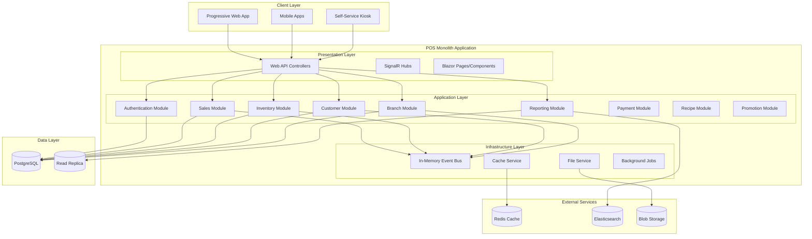
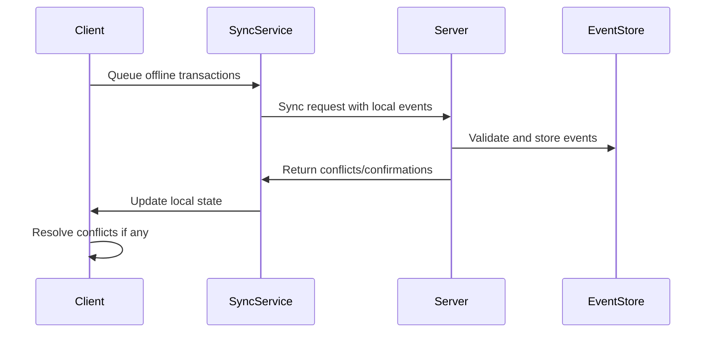

# Design Document

## Overview

The Modern POS System is designed as a modular monolith, multi-tenant SaaS application built on .NET 8. The system starts as a single deployable unit with clear module boundaries that can later be extracted into microservices as needed. It supports both online and offline operations, real-time synchronization, and can scale to accommodate businesses from single stores to large multi-branch enterprises.

### Key Design Principles

- **Modular Monolith**: Each business domain (inventory, sales, customers, etc.) is implemented as a separate module with clear boundaries
- **Offline-First**: Critical operations work without internet connectivity with automatic synchronization
- **Multi-Tenancy**: Complete data isolation between different business organizations
- **Event-Driven**: Internal event bus for loose coupling between modules
- **CQRS**: Separate read and write models for optimal performance within modules
- **Progressive Web App**: Single codebase supporting web, mobile, and desktop experiences
- **Migration Path**: Architecture designed to allow future extraction of modules into microservices

## Architecture

### High-Level Architecture



### Technology Stack

**Backend (Modular Monolith):**
- .NET 8 with ASP.NET Core Web API
- Entity Framework Core with PostgreSQL
- MediatR for CQRS and internal messaging
- SignalR for real-time updates
- Hangfire for background jobs
- FluentValidation for input validation
- AutoMapper for object mapping
- In-memory event bus for module communication

**Frontend:**
- Blazor Server/WASM hybrid for web application
- Progressive Web App (PWA) capabilities
- Tailwind CSS for styling
- SignalR client for real-time updates

**Infrastructure:**
- Docker containers for deployment
- Redis for caching and session management
- Elasticsearch for search and analytics (optional initially)
- Azure Blob Storage for file storage
- Application Insights for monitoring

**Mobile:**
- .NET MAUI for cross-platform mobile apps
- SQLite for offline data storage
- Background sync services

**Migration Strategy:**
- Module boundaries designed for future microservice extraction
- Shared kernel for common functionality
- Database per module design (within single database)
- Event-driven communication between modules

## Components and Interfaces

### Module Structure

The application is organized into the following modules, each with clear boundaries:

```
src/
├── POS.Web/                          # Presentation Layer
│   ├── Controllers/                  # API Controllers
│   ├── Hubs/                        # SignalR Hubs
│   ├── Pages/                       # Blazor Pages
│   └── Components/                  # Blazor Components
├── POS.Modules/                     # Application Modules
│   ├── Authentication/              # Auth Module
│   ├── Sales/                       # Sales Module
│   ├── Inventory/                   # Inventory Module
│   ├── Customers/                   # Customer Module
│   ├── Branches/                    # Branch Module
│   ├── Reporting/                   # Reporting Module
│   ├── Payments/                    # Payment Module
│   ├── Recipes/                     # Recipe Module
│   └── Promotions/                  # Promotion Module
├── POS.Shared/                      # Shared Kernel
│   ├── Domain/                      # Common domain objects
│   ├── Infrastructure/              # Common infrastructure
│   └── Events/                      # Domain events
└── POS.Infrastructure/              # Infrastructure Layer
    ├── Data/                        # EF Core context
    ├── Services/                    # External services
    └── BackgroundJobs/              # Background processing
```

### Core Domain Modules

#### 1. Authentication & Authorization Service

**Responsibilities:**
- JWT token management with refresh tokens
- Role-based access control (RBAC)
- Multi-factor authentication
- Session management and audit logging

**Key Interfaces:**
```csharp
public interface IAuthenticationService
{
    Task<AuthResult> AuthenticateAsync(LoginRequest request);
    Task<AuthResult> RefreshTokenAsync(string refreshToken);
    Task<bool> ValidatePermissionAsync(string userId, string permission);
    Task LogoutAsync(string userId);
}

public interface IUserManagementService
{
    Task<User> CreateUserAsync(CreateUserRequest request);
    Task<User> UpdateUserAsync(string userId, UpdateUserRequest request);
    Task<IEnumerable<User>> GetBranchUsersAsync(string branchId);
    Task<bool> ClockInAsync(string userId, string branchId);
    Task<bool> ClockOutAsync(string userId);
}
```

#### 2. Branch Management Service

**Responsibilities:**
- Multi-tenant branch configuration
- Branch-specific settings and policies
- Inter-branch data synchronization
- Device and printer management

**Key Interfaces:**
```csharp
public interface IBranchService
{
    Task<Branch> CreateBranchAsync(CreateBranchRequest request);
    Task<Branch> UpdateBranchSettingsAsync(string branchId, BranchSettings settings);
    Task<IEnumerable<Branch>> GetOrganizationBranchesAsync(string organizationId);
    Task<bool> TransferInventoryAsync(TransferRequest request);
}
```

#### 3. Product & Inventory Service

**Responsibilities:**
- Product catalog management
- Multi-branch inventory tracking
- Stock movements and adjustments
- Barcode and SKU management
- Reorder level monitoring

**Key Interfaces:**
```csharp
public interface IProductService
{
    Task<Product> CreateProductAsync(CreateProductRequest request);
    Task<Product> UpdateProductAsync(string productId, UpdateProductRequest request);
    Task<IEnumerable<Product>> SearchProductsAsync(ProductSearchCriteria criteria);
    Task<Product> GetProductByBarcodeAsync(string barcode);
}

public interface IInventoryService
{
    Task<InventoryItem> GetInventoryAsync(string productId, string branchId);
    Task<bool> AdjustStockAsync(StockAdjustmentRequest request);
    Task<IEnumerable<InventoryItem>> GetLowStockItemsAsync(string branchId);
    Task<bool> ProcessStockMovementAsync(StockMovementRequest request);
}
```

#### 4. Sales & Checkout Service

**Responsibilities:**
- Transaction processing
- Cart management
- Payment processing integration
- Receipt generation
- Offline transaction queuing

**Key Interfaces:**
```csharp
public interface ISalesService
{
    Task<Sale> CreateSaleAsync(CreateSaleRequest request);
    Task<Sale> ProcessPaymentAsync(string saleId, PaymentRequest request);
    Task<Sale> ApplyDiscountAsync(string saleId, DiscountRequest request);
    Task<Sale> ProcessRefundAsync(RefundRequest request);
    Task<IEnumerable<Sale>> GetSalesHistoryAsync(SalesHistoryRequest request);
}

public interface ICartService
{
    Task<Cart> CreateCartAsync(string userId, string branchId);
    Task<Cart> AddItemAsync(string cartId, AddCartItemRequest request);
    Task<Cart> RemoveItemAsync(string cartId, string itemId);
    Task<Cart> ApplyDiscountAsync(string cartId, string discountCode);
}
```

#### 5. Customer Management Service

**Responsibilities:**
- Customer profile management
- Purchase history tracking
- Loyalty program management
- Credit and payment tracking

**Key Interfaces:**
```csharp
public interface ICustomerService
{
    Task<Customer> CreateCustomerAsync(CreateCustomerRequest request);
    Task<Customer> UpdateCustomerAsync(string customerId, UpdateCustomerRequest request);
    Task<IEnumerable<Sale>> GetCustomerPurchaseHistoryAsync(string customerId);
    Task<CustomerLoyalty> GetLoyaltyStatusAsync(string customerId);
}
```

#### 6. Reporting & Analytics Service

**Responsibilities:**
- Real-time dashboard data
- Sales and performance reports
- Inventory analytics
- Financial reporting
- Export functionality

**Key Interfaces:**
```csharp
public interface IReportingService
{
    Task<DashboardData> GetDashboardDataAsync(string branchId, DateRange dateRange);
    Task<SalesReport> GenerateSalesReportAsync(SalesReportRequest request);
    Task<InventoryReport> GenerateInventoryReportAsync(string branchId);
    Task<byte[]> ExportReportAsync(ExportRequest request);
}
```

### Offline Synchronization Architecture

#### Offline Data Management

**Local Storage Strategy:**
- SQLite database for offline operations
- Event sourcing for conflict resolution
- Optimistic concurrency control
- Background synchronization service

**Sync Process:**


## Data Models

### Core Entities

#### Organization & Branch
```csharp
public class Organization
{
    public string Id { get; set; }
    public string Name { get; set; }
    public string SubscriptionPlan { get; set; }
    public OrganizationSettings Settings { get; set; }
    public List<Branch> Branches { get; set; }
}

public class Branch
{
    public string Id { get; set; }
    public string OrganizationId { get; set; }
    public string Name { get; set; }
    public Address Address { get; set; }
    public BranchSettings Settings { get; set; }
    public List<User> Users { get; set; }
}
```

#### Product & Inventory
```csharp
public class Product
{
    public string Id { get; set; }
    public string SKU { get; set; }
    public string Barcode { get; set; }
    public string Name { get; set; }
    public string Description { get; set; }
    public string CategoryId { get; set; }
    public decimal BasePrice { get; set; }
    public decimal Cost { get; set; }
    public List<ProductImage> Images { get; set; }
    public ProductSettings Settings { get; set; }
}

public class InventoryItem
{
    public string Id { get; set; }
    public string ProductId { get; set; }
    public string BranchId { get; set; }
    public decimal CurrentStock { get; set; }
    public decimal ReorderLevel { get; set; }
    public decimal AverageCost { get; set; }
    public decimal LastPurchasePrice { get; set; }
    public DateTime LastUpdated { get; set; }
}
```

#### Sales & Transactions
```csharp
public class Sale
{
    public string Id { get; set; }
    public string BranchId { get; set; }
    public string CustomerId { get; set; }
    public string UserId { get; set; }
    public DateTime TransactionDate { get; set; }
    public decimal SubTotal { get; set; }
    public decimal TaxAmount { get; set; }
    public decimal DiscountAmount { get; set; }
    public decimal TotalAmount { get; set; }
    public SaleStatus Status { get; set; }
    public List<SaleItem> Items { get; set; }
    public List<Payment> Payments { get; set; }
}

public class SaleItem
{
    public string Id { get; set; }
    public string ProductId { get; set; }
    public decimal Quantity { get; set; }
    public decimal UnitPrice { get; set; }
    public decimal DiscountAmount { get; set; }
    public decimal TotalAmount { get; set; }
}
```

### Database Design and Multi-Tenancy

**Multi-Tenancy Strategy: Separate Database per Tenant**
- Each organization has its own PostgreSQL database (e.g., `modernpos_org_12345`)
- Control-plane database `modernpos_control` stores tenant registry and connection metadata
- Dynamic connection resolution at request start based on tenant context
- Strong isolation, per-tenant scaling, and region placement

**Topology:**
```
PostgreSQL Cluster(s)
├── modernpos_control (shared control-plane)
│   ├── organizations
│   ├── tenant_connection_strings
│   └── audit_logs
├── modernpos_org_12345 (tenant DB)
│   ├── branches
│   ├── users
│   ├── products
│   ├── sales
│   ├── inventory
│   └── customers
└── modernpos_org_67890 (tenant DB)
    └── ...
```

**Indexing Strategy:**
- Standard indexes per tenant database
- Optional per-tenant full-text and analytics indexes
- System-wide analytics via ETL into a shared warehouse

## Error Handling

### Exception Handling Strategy

**Global Exception Handling:**
- Custom middleware for unhandled exceptions
- Structured logging with correlation IDs
- User-friendly error messages
- Automatic error reporting to monitoring systems

**Domain-Specific Errors:**
```csharp
public abstract class DomainException : Exception
{
    public string ErrorCode { get; }
    public object[] Parameters { get; }
    
    protected DomainException(string errorCode, string message, params object[] parameters) 
        : base(message)
    {
        ErrorCode = errorCode;
        Parameters = parameters;
    }
}

public class InsufficientStockException : DomainException
{
    public InsufficientStockException(string productName, decimal available, decimal requested)
        : base("INSUFFICIENT_STOCK", $"Insufficient stock for {productName}. Available: {available}, Requested: {requested}")
    {
    }
}
```

**Offline Error Handling:**
- Queue failed operations for retry
- Conflict resolution strategies
- User notification for sync failures
- Manual conflict resolution interface

## Testing Strategy

### Testing Pyramid

**Unit Tests (70%):**
- Domain logic and business rules
- Service layer functionality
- Validation and mapping logic
- Mock external dependencies

**Integration Tests (20%):**
- Database operations
- API endpoint testing
- Message queue integration
- External service integration

**End-to-End Tests (10%):**
- Critical user journeys
- Cross-service workflows
- UI automation for key scenarios
- Performance and load testing

### Test Data Management

**Test Database Strategy:**
- Containerized test databases
- Database migrations in test pipeline
- Test data builders and factories
- Cleanup strategies for isolation

**Offline Testing:**
- Mock network conditions
- Sync conflict simulation
- Performance testing under offline conditions

### Performance Testing

**Load Testing Scenarios:**
- Concurrent checkout operations
- Bulk inventory updates
- Report generation under load
- Real-time synchronization stress testing

**Performance Targets:**
- API response time < 200ms (95th percentile)
- Checkout completion < 3 seconds
- Offline sync completion < 30 seconds
- Dashboard load time < 2 seconds

## Security Considerations

### Authentication & Authorization

**JWT Token Strategy:**
- Short-lived access tokens (15 minutes)
- Long-lived refresh tokens (7 days)
- Token rotation on refresh
- Secure token storage (HttpOnly cookies for web)

**Permission Model:**
```csharp
public static class Permissions
{
    public const string ViewSales = "sales:view";
    public const string CreateSales = "sales:create";
    public const string RefundSales = "sales:refund";
    public const string ManageInventory = "inventory:manage";
    public const string ViewReports = "reports:view";
    public const string ManageUsers = "users:manage";
}
```

### Data Protection

**Encryption:**
- TLS 1.3 for data in transit
- AES-256 encryption for sensitive data at rest
- Key rotation policies
- Secure key management (Azure Key Vault)

**PII Protection:**
- Data masking in logs
- GDPR compliance features
- Data retention policies
- Secure data deletion

### API Security

**Rate Limiting:**
- Per-user and per-IP rate limits
- Sliding window rate limiting
- Different limits for different endpoints

**Input Validation:**
- Server-side validation for all inputs
- SQL injection prevention
- XSS protection
- CSRF protection

## Deployment & Infrastructure

### Containerization

**Docker Strategy:**
- Multi-stage builds for optimized images
- Separate containers for each service
- Health checks and readiness probes
- Security scanning in CI/CD pipeline

### Deployment Strategy

**Single Application Deployment:**
- Docker container with all modules
- Horizontal scaling with load balancer
- Shared database with connection pooling
- Redis for distributed caching and sessions

**Future Microservices Migration:**
- Module boundaries designed for extraction
- Database per module (logical separation)
- Event-driven communication already in place
- API versioning strategy for backward compatibility

### Monitoring & Observability

**Application Monitoring:**
- Application Insights for .NET applications
- Custom metrics and dashboards
- Real-time alerting
- Performance profiling

**Infrastructure Monitoring:**
- Kubernetes cluster monitoring
- Database performance monitoring
- Network and storage monitoring
- Cost optimization tracking

### Backup & Disaster Recovery

**Data Backup Strategy:**
- Automated daily database backups
- Point-in-time recovery capability
- Cross-region backup replication
- Regular backup restoration testing

**Disaster Recovery:**
- Multi-region deployment capability
- Automated failover procedures
- RTO: 4 hours, RPO: 1 hour
- Regular disaster recovery drills